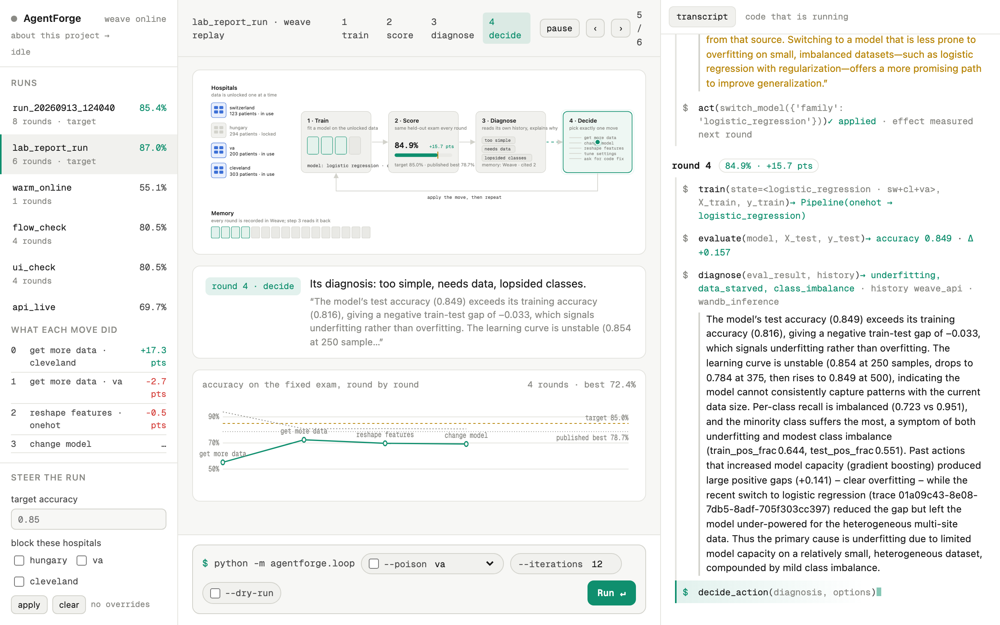
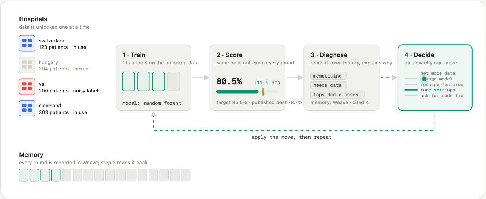
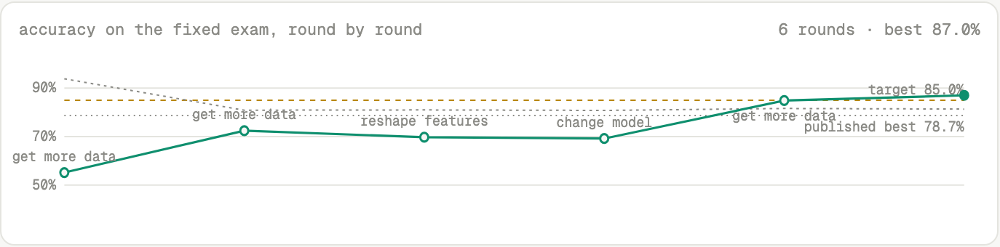
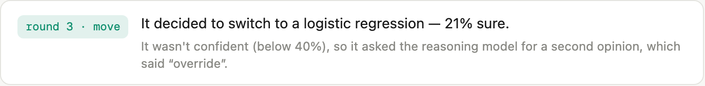
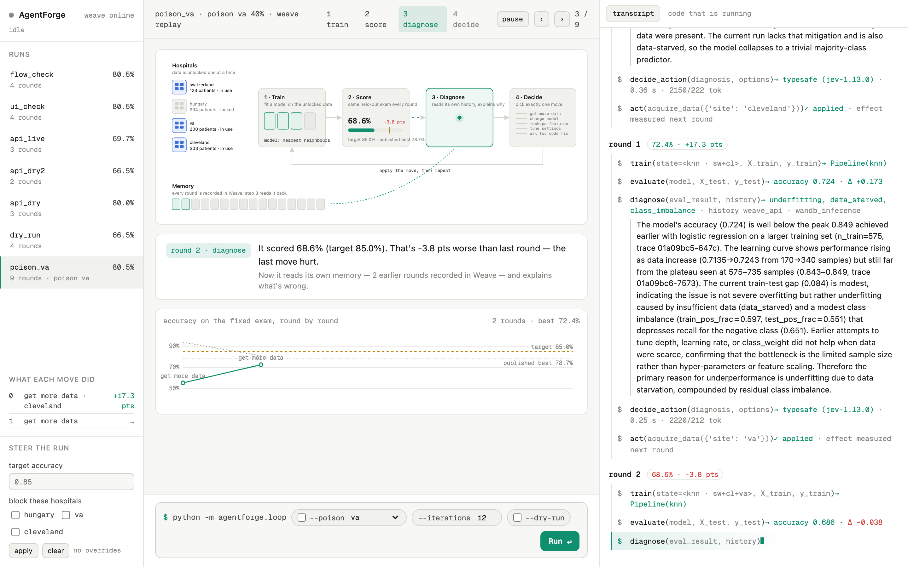
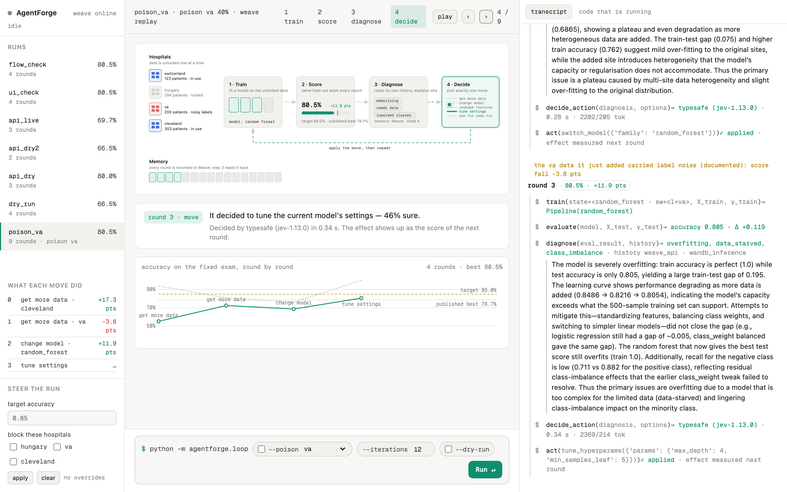
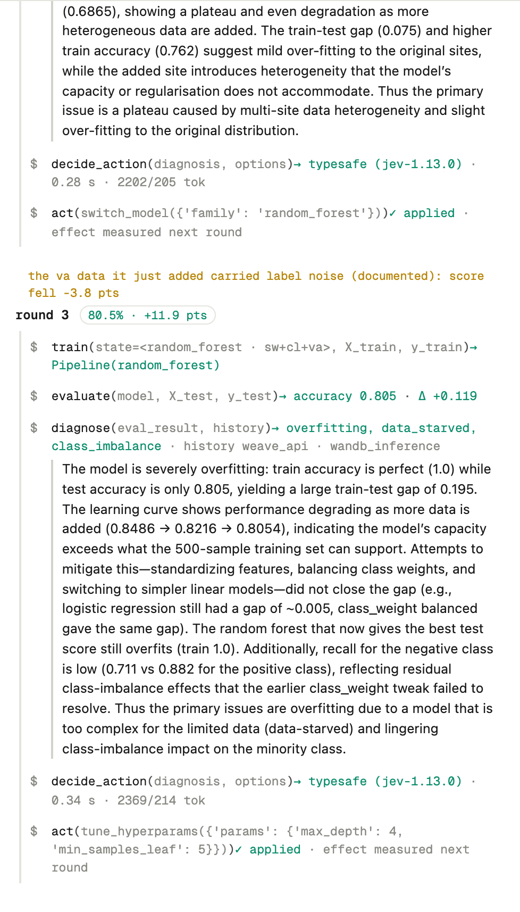
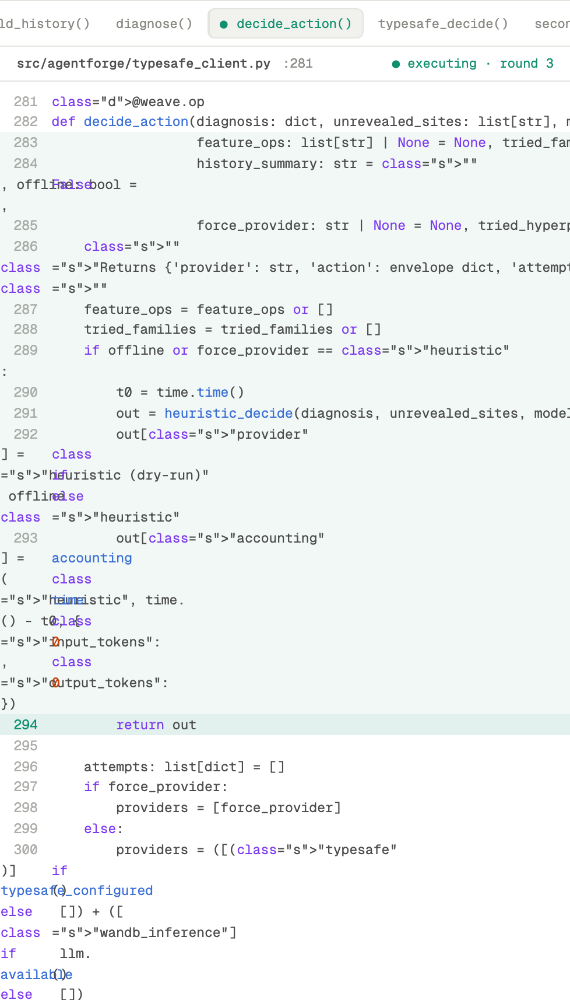
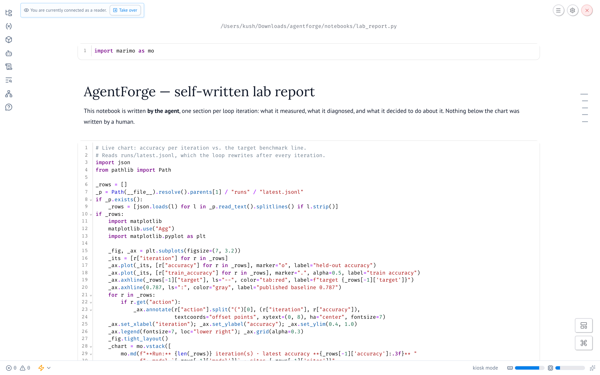
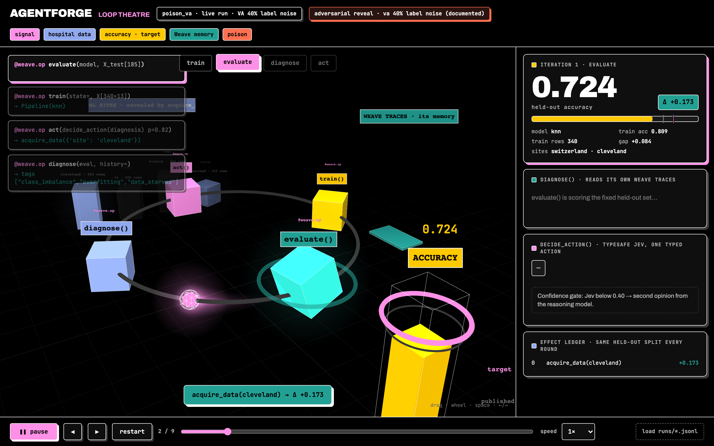

# MLforge (AgentForge) — the agent that reads its own mistakes

**A self-diagnosing, self-improving ML loop. CoreWeave Hacks (Agent Loops), Sep 12–13 2026 — built entirely during the hackathon.**

It trains a model, scores it on a fixed held-out exam, diagnoses *why* it is underperforming from its own Weave trace history, picks exactly one typed corrective move, and repeats — no human in the loop, every step observable. Starting blind at a majority-class **55%** on one skewed hospital, it reached **87%** in six rounds. When we secretly corrupted one hospital's labels, it noticed the drop from its own ledger, lost confidence, and stopped rather than pretend.

| | |
|---|---|
| 📄 **About page** (story, sponsors, detailed results, findings) | https://claude.ai/code/artifact/5ea03dcb-0bc8-4c41-b07f-b31235e60c4a |
| 🎞️ **Loop Theatre** (standalone 3D replay of a run) | https://claude.ai/code/artifact/94c6e2d2-b28c-4fb4-8710-4ad03d58a203 |
| 🏆 Track | **Best Use of Weave** · also eligible: Best Loop Design |
| 🧰 Sponsor tools | Weave · W&B Inference · TypeSafe AI · marimo · ARIA — all load-bearing |



---

## In simple words

Imagine a student taking the same exam over and over. Between attempts they decide *how* to study better — read more, change method, fix a habit. Usually a teacher decides that. Here the student decides for themselves, and keeps a diary of why.

- **The exam never changes.** 185 patients are set aside as the test before round 0 and never trained on.
- **It starts badly on purpose.** One small hospital where 93% of patients are sick → the first model guesses "everyone's sick" and scores 55%. Target: 85%.
- **Each round:** Train → Score → Diagnose (an AI reads the score *and its own past rounds*) → Decide (a faster AI picks one move from a fixed menu and says how sure it is) → apply → repeat.
- **It has a real memory** (Weave), **knows when it doesn't know** (confidence gate → second opinion), and **is honest** (fallbacks are labeled; poisoned data is noticed and declared).

---

## The loop



```
TRAIN ──▶ EVALUATE ──▶ DIAGNOSE ──▶ DECIDE ──▶ ACT ─┐
  ▲                        │                          │
  │                        ▼                          │
  │                  Weave traces  (its memory: diagnosis reads past rounds and cites trace IDs)
  └───────────────────────────────────────────────────┘
```

1. **Train** (`train.py`) — five model families (kNN, logistic regression, random forest, SVM, gradient boosting) behind one pipeline with feature ops (standardize / one-hot / log-scale / impute).
2. **Evaluate** (`evaluate.py`) — accuracy, balanced accuracy, per-class recall, train/test gap, confusion, learning-curve point, worst examples. Same seeded, fixed split every round.
3. **Diagnose** (`history.py`, `diagnose.py`) — W&B Inference (`gpt-oss-120b`) receives the evaluation **plus the agent's own past `evaluate`/`act` calls pulled from Weave**; returns evidence tags and the trace IDs it relied on.
4. **Decide** (`typesafe_client.py`) — TypeSafe System One (`jev-1.13.0`) answers typed *Choice* questions (which move; which model / feature op / site / preset) with calibrated probabilities; code assembles a pydantic-validated `ActionEnvelope`. Free text never reaches the executor. Options already shown useless are **withdrawn** from the questions.
5. **Confidence gate** — Jev confidence < 0.40 → `second_opinion()` on W&B Inference critiques the proposal against the effect ledger and may override with a validated action.
6. **Act** (`act.py`) — applies the move; the next round's score is that move's measured effect, recorded in the ledger.
7. **Report** (`notebook_writer.py`) — appends one marimo cell per round to the self-written lab report.

Stops on target, on plateau (3 moves with no gain), on operator stop, or on the iteration budget.

---

## Sponsor integrations — what each one actually does

| Sponsor | Role in the loop | Where | Status |
|---|---|---|---|
| **Weave** | Every op traced; **the agent's memory** — diagnosis reads past traces and cites their IDs; 3-way head comparison as `weave.Evaluation` | `tracing.py`, `history.py`, every `@weave.op`, `scripts/compare_action_heads.py` | ✅ live |
| **W&B Inference** | Reasoning brain: diagnosis + second opinion (`openai/gpt-oss-120b`) | `llm.py`, `diagnose.py` | ✅ live |
| **TypeSafe AI** | Structured action head: one typed move with a probability on every option, ~0.3 s | `typesafe_client.py` | ✅ live |
| **marimo** | Self-writing lab report + cockpit (human steers target / blocked sites; the loop records it) | `notebook_writer.py`, `notebooks/lab_report.py` | ✅ live |
| **ARIA** | Code-fixing arm: `request_code_fix` → `aria_requests/NNN.md` → `.applied` → acceptance test → new option registered in `extensions.py` (self-extending action space) | `aria_handoff.py`, `extensions.py` | 🟡 protocol built + tested; no live fix executed yet |

Honesty rule: a sponsor tool appears in a log only if its call succeeded; every fallback is labeled with its cause in the trace, the terminal and the report.

---

## Results

### Run A — clean, TypeSafe-decided with the gate on: 55.1% → 87.0% in 6 rounds

| Round | Data · model | Score | Δ | Diagnosis | Move (confidence) |
|---|---|---|---|---|---|
| 0 | Switzerland · kNN | 55.1% | — | memorising, needs data, lopsided | unlock Cleveland (100%) |
| 1 | +Cleveland · kNN | 72.4% | +17.3 | too simple, memorising, needs data | unlock VA (74%) |
| 2 | +VA · kNN | 69.7% | −2.7 | memorising, needs data, lopsided, stuck | one-hot features (57%) |
| 3 | + one-hot · kNN | 69.2% | −0.5 | same | **gate fired (21%) → Inference overrode: logistic regression** |
| 4 | · logistic regression | 84.9% | **+15.7** | too simple, needs data | unlock Hungary (52%) |
| 5 | all four · logistic regression | **87.0%** | +2.1 | — | target beaten, stop |





### Run B — adversarial: 40% of VA's training labels flipped (documented; agent not told)



The ledger recorded VA as the only acquisition that ever hurt (−3.8 pts); the diagnosis said so in words and cited the trace; confidence dropped 85% → 53% → 36% (gate fired). It plateaued at 82.7% and stopped honestly — and it never unlocked the clean Hungary site, which is the documented weakness.

### Which decision-maker decides better? (`make compare`, a `weave.Evaluation`)

Nine recorded diagnoses replayed through three heads; each proposed move re-applied to the recorded state and retrained on the same split.

| Head | Valid typed action | Agrees w/ run | Mean counterfactual Δacc | Latency | Tokens |
|---|---|---|---|---|---|
| rules (baseline) | 9/9 | 5/9 | +0.054 | 0.00 s | 0 |
| **TypeSafe Jev 1.13** | 9/9 | 8/9 | +0.046 | **0.35 s** | 2,469 |
| W&B Inference gpt-oss-120b | 9/9 | 5/9 | +0.038 | 7.19 s | 2,482 |

Honest read: n = 9, Δ differences are noise; what is not noise is a 20× latency gap at equal tokens plus calibrated probabilities that make the gate possible. Full tables, the hand-picked baselines (70–88%), and limitations (run variance, project-wide memory as feature *and* confound) are on the [About page](https://claude.ai/code/artifact/5ea03dcb-0bc8-4c41-b07f-b31235e60c4a).

---

## What you can run

### Live console (frontend + backend)



`make serve` → http://127.0.0.1:8008 — FastAPI backend runs the loop in a worker thread and streams every phase / iteration / log line over Server-Sent Events. Start runs (optionally poisoned), stop them, replay past runs, steer with the cockpit. Right pane: transcript of real calls with arguments and return values, and the actual source of each traced function (`/api/source`, via `inspect.getsource`) highlighted while it executes.

| | |
|---|---|
|  |  |

### Self-written lab report (marimo)



### Loop Theatre (3D replay)



---

## Quickstart

```bash
make setup                 # uv venv (Python 3.12) + deps
make data                  # fetch UCI heart disease, 4 sites -> data/
make dry-run               # full loop OFFLINE with a rule-based brain — must always pass
cp .env.example .env       # WANDB_API_KEY, WANDB_ENTITY, TYPESAFE_API_KEY
make run                   # live loop: Weave online, Inference diagnoses, Jev decides, report writes itself
make run-poison            # adversarial reveal (40% label noise on VA's train rows, documented)
make serve                 # backend + live console at http://127.0.0.1:8008  (/about for the story)
make report                # marimo edit notebooks/lab_report.py
make compare               # three-way action-head leaderboard in Weave
make test                  # pytest (71 tests, offline) + dry-run — required before every commit
```

Environment: `WANDB_API_KEY` (+ `WANDB_ENTITY` — W&B Inference needs `entity/project`), `TYPESAFE_API_KEY` (SDK defaults to `https://api.typesafe.ai`, `jev-latest`). Without keys the loop still runs, labeled `heuristic`/`offline`.

---

## Project structure

```
src/agentforge/
  loop.py            orchestrator: run_iteration, stop rules, CLI (--dry-run, --poison, --iterations)
  state.py           LoopState, effect attribution (record_action / settle_effect), runs/*.jsonl metrics
  data.py            per-site CSVs; fixed_split() holds out the exam from EVERY site once; poison_labels()
  train.py           model zoo, feature ops, hyperparameter grids (+ ARIA-registered extensions)
  evaluate.py        EvalResult: accuracy, balanced acc, PRF, confusion, gap, learning curve, worst-K
  history.py         the memory: fetch past evaluate/act calls from Weave, merge with local ledger
  diagnose.py        W&B Inference diagnosis -> evidence tags + cited trace IDs (labeled fallback)
  typesafe_client.py TypeSafe System One action head, second_opinion() gate, per-decision accounting
  heuristics.py      rule-based brain for --dry-run and last-resort fallback (always labeled)
  actions.py         pydantic action space (the safety boundary); act.py: validated executor
  extensions.py      self-extending action space: register_model / register_feature_op (ARIA target)
  aria_handoff.py    fix request files, .applied detection, acceptance test, action_space_added
  notebook_writer.py appends one marimo cell per round; reset_notebook()
  events.py          in-process event bus + STOP flag;  server.py: FastAPI + SSE + /api/source
  tracing.py         weave.init online/offline (re-initialisable), config()
demo/                index.html (console), about.html, loop3d.html, shots/ (screenshots)
notebooks/           lab_report.py (marimo, agent-written)
scripts/             fetch_data.py, compare_action_heads.py (weave.Evaluation), embed_run.py
tests/               71 tests; credentials blanked so .env can never leak into tests
docs/                SPEC, ARCHITECTURE, SPONSORS (judge talking points), DEMO_SCRIPT, ARIA, PLAN
```

## Rules we never break

1. **Everything observable** — every train/evaluate/diagnose/act function is a `@weave.op`.
2. **Honest logs only** — a sponsor tool is logged only if it ran; fallbacks carry their cause.
3. **Actions are typed** — pydantic models only; free text never reaches the executor.
4. **Fixed exam** — held out from every site before round 0; acquisitions only grow the training pool.
5. **Always runnable** — `python -m agentforge.loop --dry-run` passes offline, before every commit.
6. **Built this weekend** — every commit on Sep 13, 2026; no code imported from prior projects.

## Tech stack

Python 3.12 · scikit-learn · pandas · NumPy · Pydantic v2 · Weave · W&B Inference (OpenAI-compatible) · `typesafe-sdk` · marimo · FastAPI + Uvicorn + SSE · vanilla HTML/CSS/JS (SVG flowchart, EventSource) · Three.js (3D page) · pytest · Playwright (screenshots) · Rich · uv

Dataset: UCI Heart Disease (Cleveland, Hungary, Switzerland, VA) — public, anonymised research data; no PHI, no clinical claims.
